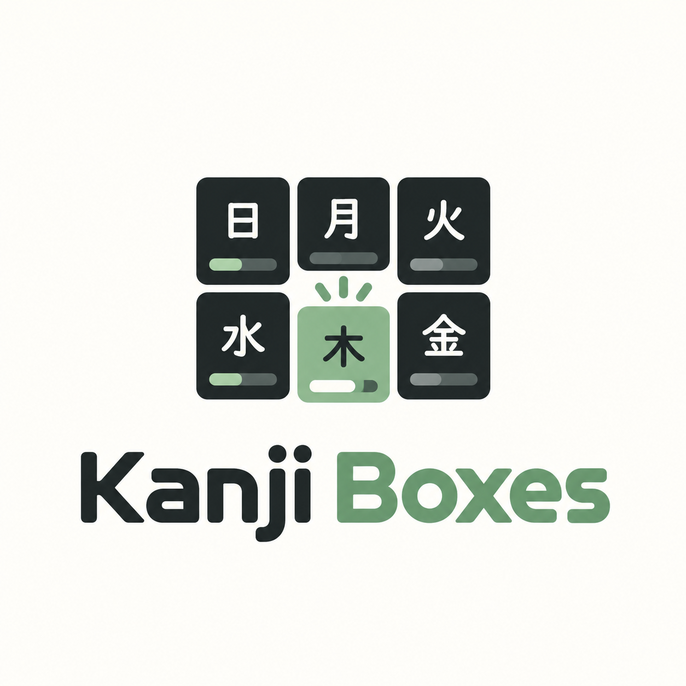

<p align="center">
  
</p>

# Kanji Boxes

Terminal kanji trainer built on the Leitner box system, written in Go with Bubble Tea.

Cards move through 6 boxes. A correct answer moves a card up one box, a wrong answer drops it one box, and each box has its own review interval.

## How scheduling works

| Box | Interval |
| --- | -------- |
| 1   | 1 day    |
| 2   | 3 days   |
| 3   | 7 days   |
| 4   | 14 days  |
| 5   | 30 days  |
| 6   | 60 days  |

- **Answer speed counts.** A correct answer only promotes the card if you answer within 3 seconds of the card appearing. A slower correct answer keeps the card in its current box and reschedules it at that box's interval. The review screen shows a live elapsed timer.
- **Box 1 is capped at 20 new cards.** Extra new cards wait in line, ordered by creation date. When a card is promoted out of box 1, the next card in line takes its slot. Cards that fell back to box 1 from a higher box (relearning) don't count toward the cap and are always reviewed.
- **Due order.** The review queue starts with the most overdue cards. Cards due on the same day are shuffled so you can't memorize them by position.

## Review modes

Each due card gets a random mode for the session:

| Mode                    | Share | Front                                       | Back                          |
| ----------------------- | ----- | ------------------------------------------- | ----------------------------- |
| Recognition `[認識]`    | 30%   | Kanji (plus reading if set)                 | Reading, English, usage       |
| Cloze `[穴埋め]`        | 10%   | Usage sentence with the kanji blanked out   | Kanji, English, reading       |
| Production `[産出]`     | 60%   | English                                     | Kanji, reading, usage         |

Cloze falls back to showing the kanji when a card has no usage sentence.

When a session ends, the app lists every card you missed with its reading, meaning, new box and usage sentence.

## Requirements

- Go 1.25+
- Optional: `OPENAI_API_KEY` for AI autofill when adding cards

## Run

```bash
go mod download
go run .
```

Or build the binary:

```bash
make build
./kanji-box
```

## Install

With Go installed:

```bash
go install github.com/Kai-Animator/kanji-boxes@latest
kanji-boxes
```

The binary lands in `$(go env GOPATH)/bin` (usually `~/go/bin`), which needs to be on your `PATH`.

From a clone, `make install` builds the binary as `kanji-box` into `~/.local/bin`:

```bash
make install
export PATH="$HOME/.local/bin:$PATH"
kanji-box
```

Add the `PATH` export to your shell profile (for example `~/.zshrc`) to keep it.

## Data storage

Data lives in your OS user config directory:

- macOS: `~/Library/Application Support/kanji-boxes`
- Linux: `~/.config/kanji-boxes`
- Windows: `%AppData%\kanji-boxes`

Override it with:

```bash
KANJI_BOXES_DIR=/path/to/data kanji-box
```

Files:

- `cards.json`: cards, boxes and due dates
- `state.json`: daily review stats

## Usage

Run with no arguments to open the app. `--help` prints usage and the current data directory, and `--version` prints the version.

`q` quits from any screen without a text field (menu, review, browse, stats). `ctrl+c` quits from anywhere.

### Main menu

Review, Add Card, Browse, Import / Export, Stats, Quit.

- `up/down` or `k/j`: move
- `enter`: select

### Review

The header shows due cards, progress, and how many new cards are waiting for a box 1 slot.

- `space`: flip card
- `y`: correct
- `n`: incorrect
- `esc`: back to menu

### Add card

Fields: kanji and English (required), hiragana, usage sentence, tags separated by `|`.

- `tab/shift+tab` or `up/down`: move between fields
- `enter`: next field, or save on the last field
- `ctrl+f`: fill all empty fields with AI, based on what you typed
- `ctrl+r`: regenerate the focused field with AI
- `esc`: back

AI autofill calls OpenAI (`gpt-4o-mini`) and needs `OPENAI_API_KEY` set in your shell.

### Browse

Lists all cards with their box number and a details pane for the selected card. Cards waiting for a box 1 slot show `[-]` and their position in line instead of a box and due date.

- `up/down` or `k/j`: move (wraps around at either end)
- `/`: search by kanji, hiragana or English (English is case-insensitive)
- `e`: edit selected card
- `d`: delete selected card (asks `y/n`)
- `esc`: clear the search, or go back to the menu

While typing a search, `enter` keeps the filter and returns to the list, and `esc` clears it.

### Edit card

Same fields as Add Card, plus:

- **Box level**: set the card's box (1 to 6)
- **Reset next due**: enter `y` to make the card due today

### Import / Export

Pick Import CSV or Export CSV, then enter a file path.

Export writes `kanji,hiragana,english,usage,tags,box`. Import appends cards and accepts three layouts:

- `kanji,hiragana,english,usage,tags,box`
- `kanji,hiragana,english,usage,tags`
- `kanji,hiragana,english,tags` (legacy)

The header row is optional. Imported cards are due today. Without a `box` column, or with an invalid value, they start in box 1.

### Stats

Today's reviewed, correct and incorrect counts with an accuracy bar, plus a history table for the last 7 days.

## Development

```bash
make test       # go test ./...
make typecheck  # go build ./...
make lint       # go vet ./...
make coverage   # HTML coverage report
make dev        # fmt, typecheck, test
```

CI runs build and tests with the race detector on every push and pull request to `main`.

## License

[MIT](LICENSE)
